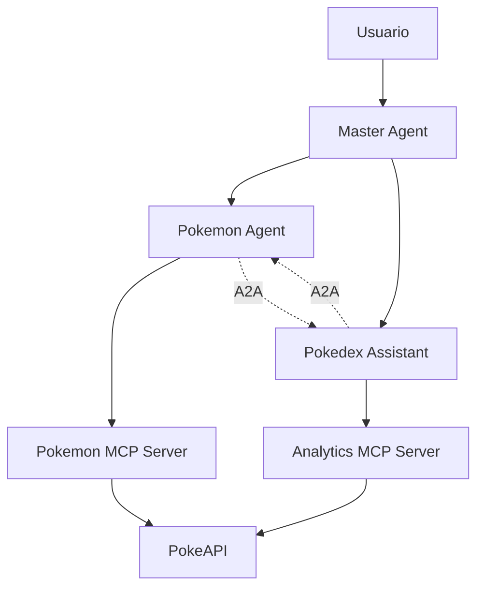

# Pokemon Agent Ecosystem - ADK, MCP & A2A Integration

## 📖 Descripción General

Este proyecto es una demostración completa de un ecosistema de agentes inteligentes especializados en información Pokemon, implementado usando tres tecnologías clave de Google:

- **ADK (Agent Development Kit)** - Framework para crear agentes con LLM
- **MCP (Model Context Protocol)** - Protocolo para herramientas y funcionalidades externas
- **A2A (Agent-to-Agent)** - Comunicación e interoperabilidad entre agentes

## 🏗️ Arquitectura del Sistema

### Componentes Principales

```
Pokemon Agent Ecosystem
├── Pokemon Agent (Puerto 10001)           # Agente principal de información Pokemon
├── Pokedex Assistant (Puerto 10002)       # Agente analítico especializado  
├── Master Agent (Puerto 10003)           # Agente orquestador
├── Pokemon MCP Server (Puerto 8080)      # Servidor de herramientas básicas
└── Analytics MCP Server (Puerto 8081)    # Servidor de análisis y comparaciones
```

### Flujo de Datos



## 🤖 Agentes del Sistema

### 1. Pokemon Agent (`pokemon_agent/`)
**Puerto:** 10001  
**Especialidad:** Información básica de Pokemon

#### Funcionalidades:
- ✅ Información detallada de Pokemon individuales
- ✅ Datos de especies y descripciones
- ✅ Búsqueda y listado de Pokemon
- ✅ Comunicación A2A con Pokedex Assistant

#### Herramientas MCP:
- `get_pokemon_info(pokemon_name)` - Información completa del Pokemon
- `get_pokemon_species(pokemon_name)` - Datos de especie y evolución  
- `search_pokemon(limit, offset)` - Búsqueda paginada

#### Capacidades A2A:
- Puede solicitar análisis comparativos al Pokedex Assistant
- Maneja derivaciones de consultas analíticas
- Colaboración automática para respuestas complejas

### 2. Pokedex Assistant (`pokedex_assistant/`)
**Puerto:** 10002  
**Especialidad:** Análisis y comparaciones Pokemon

#### Funcionalidades:
- 📊 Comparaciones estadísticas detalladas
- ⚔️ Análisis de efectividad de tipos
- 🎯 Generación de trivia y datos curiosos
- 📈 Rankings estadísticos

#### Herramientas MCP:
- `compare_pokemon_stats(pokemon1, pokemon2)` - Comparación estadística
- `calculate_type_effectiveness(attacker_type, defender_types)` - Efectividad de tipos
- `generate_pokemon_trivia(pokemon_name)` - Trivia y curiosidades
- `get_stat_rankings(stat_name, limit)` - Rankings por estadística

#### Capacidades A2A:
- Puede solicitar información básica al Pokemon Agent
- Especializado en análisis profundos y educativos
- Proporciona insights estadísticos avanzados

### 3. Master Agent (`master-agent/`)
**Puerto:** 10003  
**Especialidad:** Orquestación y coordinación

#### Funcionalidades:
- 🎭 Coordinación entre agentes especializados
- 🔀 Enrutamiento inteligente de consultas
- 📋 Gestión de flujos de trabajo complejos
- 🤝 Orquestación de colaboraciones A2A

## 🛠️ Servidores MCP

### Pokemon MCP Server (`mcp-server/`)
**Puerto:** 8080  
**Propósito:** Herramientas básicas de Pokemon

#### Herramientas Disponibles:
```python
# Información básica
get_pokemon_info(pokemon_name: str) -> Dict

# Datos de especie  
get_pokemon_species(pokemon_name: str) -> Dict

# Búsqueda y listado
search_pokemon(limit: int = 20, offset: int = 0) -> Dict
```

### Analytics MCP Server (`analytics-mcp-server/`)
**Puerto:** 8081  
**Propósito:** Análisis y comparaciones avanzadas

#### Herramientas Disponibles:
```python
# Comparaciones estadísticas
compare_pokemon_stats(pokemon1: str, pokemon2: str) -> Dict

# Análisis de batalla
calculate_type_effectiveness(attacker_type: str, defender_types: List[str]) -> Dict

# Generación de trivia
generate_pokemon_trivia(pokemon_name: str) -> Dict

# Rankings estadísticos
get_stat_rankings(stat_name: str, limit: int = 10) -> Dict
```

## 🔄 Comunicación A2A (Agent-to-Agent)

### Protocolo de Comunicación

El sistema implementa comunicación A2A bidireccional entre agentes:

```python
# Pokemon Agent solicitando análisis
comparison = await pokemon_agent.request_pokemon_comparison("Pikachu", "Raichu")

# Pokedex Assistant solicitando información básica  
basic_info = await assistant_agent.request_pokemon_info("Charizard")
```

### Patrones de Colaboración

1. **Derivación Inteligente**
   - Pokemon Agent deriva consultas analíticas → Pokedex Assistant
   - Pokedex Assistant solicita información básica → Pokemon Agent

2. **Análisis Colaborativo**
   - Combinación de datos básicos + análisis profundo
   - Respuestas enriquecidas con múltiples perspectivas

3. **Flujos de Trabajo Complejos**
   - Orquestación via Master Agent
   - Secuencias de tareas coordinadas

## ✨ Ventajas de la Arquitectura

### 🎯 Especialización por Dominio
- **Separación de responsabilidades**: Cada agente tiene un propósito específico
- **Expertise focalizado**: Pokemon Agent para datos, Assistant para análisis
- **Escalabilidad**: Fácil agregar nuevos agentes especializados

### 🔌 Modularidad MCP
- **Herramientas reutilizables**: Servidores MCP independientes
- **Fácil mantenimiento**: Lógica de negocio separada de agentes
- **Testabilidad**: Cada componente se puede probar por separado

### 🤝 Colaboración A2A
- **Interoperabilidad**: Agentes pueden comunicarse seamlessly  
- **Enriquecimiento de respuestas**: Combinación automática de capacidades
- **Flujos complejos**: Orquestación de tareas multi-agente

### 📈 Escalabilidad y Extensibilidad
- **Horizontal**: Agregar nuevos agentes especializados
- **Vertical**: Extender capacidades de agentes existentes
- **Plug-and-play**: Nuevos servidores MCP sin modificar agentes

## 🚀 Configuración e Instalación

### Prerequisitos
```bash
# Python 3.10+
python --version

# uv package manager
curl -LsSf https://astral.sh/uv/install.sh | sh
```

### Instalación
```bash
# Clonar proyecto
git clone <repository-url>
cd pokemon-agent

# Instalar dependencias
uv sync

# Configurar variables de entorno
cp .env.example .env
# Editar .env con configuración necesaria
```

### Configuración de Variables
```bash
# .env
GOOGLE_API_KEY=your_gemini_api_key
A2A_HOST=localhost
A2A_PORT=10001
A2A_PORT_ASSISTANT=10002
A2A_PORT_MASTER=10003
MCP_SERVER_URL=http://localhost:8080/mcp
ANALYTICS_MCP_SERVER_URL=http://localhost:8081/mcp
POKEMON_AGENT_URL=http://localhost:10001
ASSISTANT_AGENT_URL=http://localhost:10002
```

## 🏃‍♂️ Ejecución

### Iniciar Servidores MCP
```bash
# Terminal 1 - Pokemon MCP Server
cd mcp-server
uv run server.py

# Terminal 2 - Analytics MCP Server  
cd analytics-mcp-server
uv run server.py
```

### Iniciar Agentes
```bash
# Terminal 3 - Pokemon Agent
cd pokemon_agent
uv run uvicorn pokemon_agent.agent:a2a_app --host localhost --port 10001

# Terminal 4 - Pokedex Assistant
cd pokedex_assistant  
uv run uvicorn pokedex_assistant.agent:a2a_app --host localhost --port 10002

# Terminal 5 - Master Agent
cd master-agent
uv run adk web
```

## 📝 Ejemplos de Uso

### Consulta Básica - Pokemon Agent
```python
# Información básica
"Tell me about Pikachu"
→ Stats, types, abilities, sprite

# Búsqueda
"Show me the first 10 Pokemon" 
→ Lista paginada con IDs y nombres

# Especies
"What's the description of Charizard?"
→ Flavor text, habitat, generation
```

### Análisis Avanzado - Pokedex Assistant
```python
# Comparación estadística
"Compare Charizard vs Blastoise"
→ Análisis detallado de stats base, winner por categoría

# Efectividad de tipos
"How effective is Electric against Water/Flying?"
→ Multiplicadores, descripciones, estrategia de batalla

# Trivia educativa
"Generate interesting facts about Alakazam"
→ Stats destacados, curiosidades, datos Pokedex
```

### Colaboración A2A
```python
# Análisis colaborativo automático
"I want a complete analysis of Dragonite vs Salamence"
→ Pokemon Agent: datos básicos
→ Pokedex Assistant: comparación detallada  
→ Resultado: análisis completo enriquecido
```

## 🧪 Testing y Demos


### Workflows Disponibles:
1. **Individual Agent Queries** - Consultas directas a cada agente
2. **Collaborative Analysis** - Análisis que requiere ambos agentes  
3. **Specialized Queries** - Funcionalidades específicas por agente
4. **Interactive Mode** - Modo interactivo para testing manual

### Comandos de Testing:
```bash
# Modo interactivo
> pokemon Tell me about Mew
> assistant Compare Mew vs Mewtwo  
> compare Pikachu Raichu
> quit
```

## 🛡️ Consideraciones de Seguridad y Producción

### Seguridad
- Variables de entorno para API keys
- Timeouts en comunicaciones HTTP
- Validación de entrada en herramientas MCP
- Logging estructurado para debugging

### Monitoreo
- Logs detallados en cada componente
- Métricas de performance por agente
- Tracking de comunicaciones A2A
- Health checks para servidores MCP

### Escalabilidad
- Arquitectura stateless
- Comunicación HTTP asíncrona
- Balanceeo de carga posible
- Contenainerización ready

## 📚 Recursos Adicionales

### Documentación Técnica
- [Google ADK Documentation](https://cloud.google.com/agent-builder)
- [MCP Protocol Specification](https://spec.modelcontextprotocol.io/)
- [PokeAPI Documentation](https://pokeapi.co/docs/v2)

### Arquitectura de Referencia
- **Microservicios**: Cada agente como servicio independiente
- **Event-driven**: Comunicación asíncrona entre componentes  
- **Domain-driven**: Separación por dominios de conocimiento
- **API-first**: Interfaces bien definidas entre servicios

## 🤝 Contribución

### Estructura para Nuevos Agentes
1. Crear directorio `new_agent/`
2. Implementar `agent.py` con ADK + A2A
3. Definir `AgentCard` con skills específicos
4. Configurar puerto único en variables de entorno
5. Documentar en README

### Estructura para Nuevos MCP Servers  
1. Crear directorio `new_mcp_server/`
2. Implementar herramientas con FastMCP
3. Configurar puerto único
4. Agregar tests en `test_server.py`
5. Actualizar documentación de herramientas

---

**🎯 Objetivo:** Demostrar las capacidades de ADK, MCP y A2A en un ecosistema de agentes especializados, colaborativos y escalables.