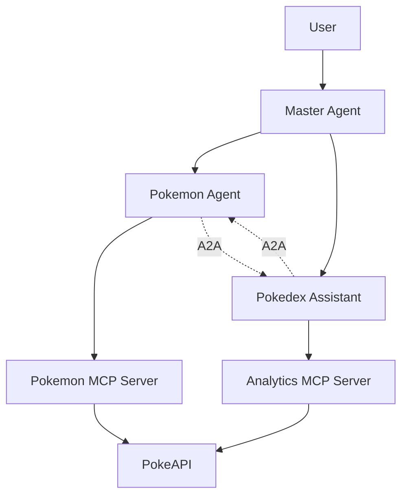
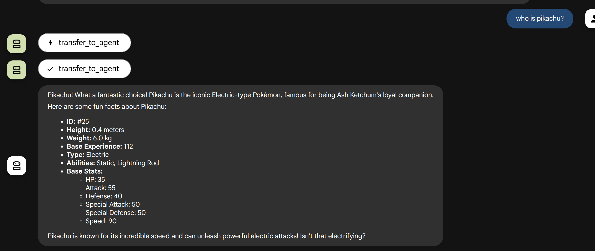
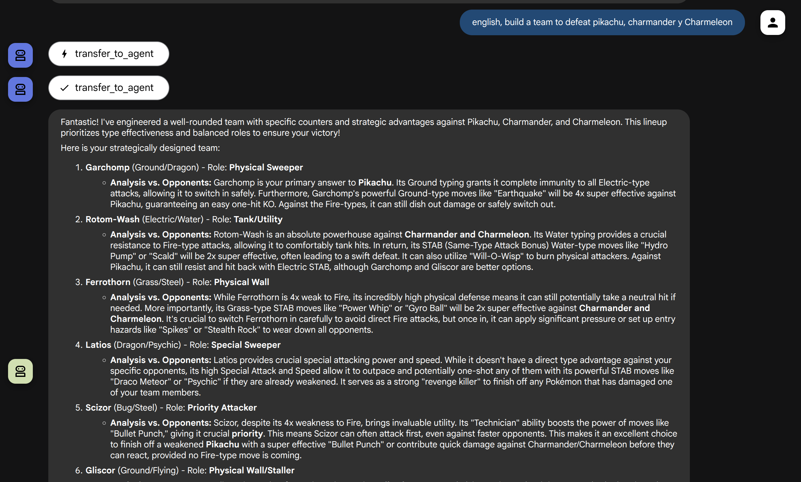
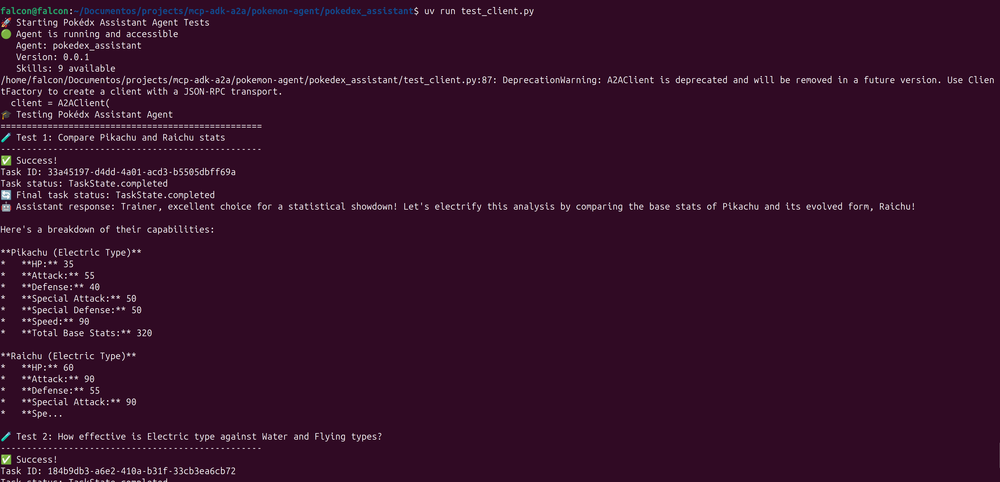

# Pokemon Agent Ecosystem - ADK, MCP & A2A Integration

## 📖 Overview

This project is a comprehensive demonstration of an intelligent agent ecosystem specialized in Pokemon information, implemented using three key Google technologies:

- **ADK (Agent Development Kit)** - Framework for creating LLM-powered agents
- **MCP (Model Context Protocol)** - Protocol for external tools and functionalities  
- **A2A (Agent-to-Agent)** - Communication and interoperability between agents

## 🏗️ System Architecture

### Core Components

```
Pokemon Agent Ecosystem
├── Pokemon Agent (Port 10001)           # Main Pokemon information agent
├── Pokedex Assistant (Port 10002)       # Specialized analytical agent
├── Master Agent (ADK Web)               # Orchestrator agent
├── Pokemon MCP Server (Port 8080)       # Basic tools server
└── Analytics MCP Server (Port 8081)     # Analysis and comparison server
```

### Data Flow



## 🤖 System Agents

### 1. Pokemon Agent (`pokemon_agent/`)
**Port:** 10001  
**Specialty:** Basic Pokemon information

#### Features:
- ✅ Detailed individual Pokemon information
- ✅ Species data and descriptions
- ✅ Pokemon search and listing
- ✅ A2A communication with Pokedex Assistant

#### MCP Tools:
- `get_pokemon_info(pokemon_name)` - Complete Pokemon information
- `get_pokemon_species(pokemon_name)` - Species and evolution data
- `search_pokemon(limit, offset)` - Paginated search

#### A2A Capabilities:
- Can request comparative analysis from Pokedex Assistant
- Handles analytical query delegations
- Automatic collaboration for complex responses

### 2. Pokedex Assistant (`pokedex_assistant/`)
**Port:** 10002  
**Specialty:** Pokemon analysis, comparisons, and team building

#### Features:
- 📊 Detailed statistical comparisons
- ⚔️ Type effectiveness analysis
- 🎯 Trivia and fun facts generation
- 📈 Statistical rankings
- 🏆 **Strategic team building**
- 🔍 **Team composition analysis**
- ⚡ **Team optimization suggestions**
- 🎨 **Type coverage calculations**

#### MCP Tools:
**Analysis Tools:**
- `compare_pokemon_stats(pokemon1, pokemon2)` - Statistical comparison
- `calculate_type_effectiveness(attacker_type, defender_types)` - Type effectiveness
- `generate_pokemon_trivia(pokemon_name)` - Trivia and curiosities
- `get_stat_rankings(stat_name, limit)` - Rankings by statistic

**Team Building Tools:**
- `build_pokemon_team(strategy, team_size)` - Create strategic teams
- `analyze_team_composition(pokemon_list)` - Analyze team strengths/weaknesses
- `suggest_team_improvements(current_team, strategy)` - Optimization suggestions
- `calculate_team_coverage(pokemon_list)` - Type coverage analysis

#### Team Building Strategies:
- **Balanced**: Well-rounded teams with good type coverage and stat distribution
- **Offensive**: High-damage teams focused on overwhelming opponents
- **Defensive**: Tanky teams designed to outlast opponents

#### A2A Capabilities:
- Can request basic information from Pokemon Agent
- Specialized in deep analysis and educational insights
- Provides advanced strategic insights and team composition advice

### 3. Master Agent (`master-agent/`)
**Execution:** ADK Web  
**Specialty:** Orchestration and coordination

#### Features:
- 🎭 Coordination between specialized agents
- 🔀 Intelligent query routing
- 📋 Complex workflow management
- 🤝 A2A collaboration orchestration

## 🛠️ MCP Servers

### Pokemon MCP Server (`mcp-server/`)
**Port:** 8080  
**Purpose:** Basic Pokemon tools

#### Available Tools:
```python
# Basic information
get_pokemon_info(pokemon_name: str) -> Dict

# Species data
get_pokemon_species(pokemon_name: str) -> Dict

# Search and listing
search_pokemon(limit: int = 20, offset: int = 0) -> Dict
```

### Analytics MCP Server (`analytics-mcp-server/`)
**Port:** 8081  
**Purpose:** Advanced analysis, comparisons, and team building

#### Available Tools:
```python
# Statistical comparisons
compare_pokemon_stats(pokemon1: str, pokemon2: str) -> Dict

# Battle analysis
calculate_type_effectiveness(attacker_type: str, defender_types: List[str]) -> Dict

# Trivia generation
generate_pokemon_trivia(pokemon_name: str) -> Dict

# Statistical rankings
get_stat_rankings(stat_name: str, limit: int = 10) -> Dict

# Team building tools
build_pokemon_team(strategy: str = "balanced", team_size: int = 6) -> Dict
analyze_team_composition(pokemon_list: List[str]) -> Dict
suggest_team_improvements(current_team: List[str], strategy: str = "balanced") -> Dict
calculate_team_coverage(pokemon_list: List[str]) -> Dict
```

## 🔄 A2A (Agent-to-Agent) Communication

### Communication Protocol

The system implements bidirectional A2A communication between agents:

```python
# Pokemon Agent requesting analysis
comparison = await pokemon_agent.request_pokemon_comparison("Pikachu", "Raichu")

# Pokedex Assistant requesting basic information
basic_info = await assistant_agent.request_pokemon_info("Charizard")
```

### Collaboration Patterns

1. **Intelligent Delegation**
   - Pokemon Agent delegates analytical queries → Pokedx Assistant
   - Pokedx Assistant requests basic information → Pokemon Agent

2. **Collaborative Analysis**
   - Combination of basic data + deep analysis
   - Enriched responses with multiple perspectives

3. **Complex Workflows**
   - Orchestration via Master Agent
   - Coordinated task sequences

## ✨ Architecture Advantages

### 🎯 Domain Specialization
- **Separation of concerns**: Each agent has a specific purpose
- **Focused expertise**: Pokemon Agent for data, Assistant for analysis and team building
- **Scalability**: Easy to add new specialized agents

### 🔌 MCP Modularity
- **Reusable tools**: Independent MCP servers
- **Easy maintenance**: Business logic separated from agents
- **Testability**: Each component can be tested separately

### 🤝 A2A Collaboration
- **Interoperability**: Agents can communicate seamlessly
- **Response enrichment**: Automatic combination of capabilities
- **Complex flows**: Multi-agent task orchestration

### 📈 Scalability and Extensibility
- **Horizontal**: Add new specialized agents
- **Vertical**: Extend capabilities of existing agents
- **Plug-and-play**: New MCP servers without modifying agents

## 🚀 Setup and Installation

### Prerequisites
```bash
# Python 3.10+
python --version

# uv package manager
curl -LsSf https://astral.sh/uv/install.sh | sh
```

### Installation
```bash
# Clone project
git clone <repository-url>
cd pokemon-agent

# Install dependencies
uv sync

# Configure environment variables
cp .env.example .env
# Edit .env with necessary configuration
```

### Environment Configuration
```bash
# .env
GOOGLE_GENAI_USE_VERTEXAI=TRUE
GOOGLE_CLOUD_PROJECT=your-project-id
GOOGLE_CLOUD_LOCATION=us-central1

# A2A Agent Configuration
A2A_HOST=localhost
A2A_PORT=10001
A2A_PORT_ASSISTANT=10002

# MCP Server URLs
MCP_SERVER_URL=http://localhost:8080/mcp
ANALYTICS_MCP_SERVER_URL=http://localhost:8081/mcp

# Inter-agent Communication URLs
POKEMON_AGENT_URL=http://localhost:10001
ASSISTANT_AGENT_URL=http://localhost:10002
```

## 🏃‍♂️ Execution

### Start MCP Servers
```bash
# Terminal 1 - Pokemon MCP Server
cd mcp-server
uv run server.py

# Terminal 2 - Analytics MCP Server
cd analytics-mcp-server
uv run server.py
```

### Start Agents
```bash
# Terminal 3 - Pokemon Agent
uv run uvicorn pokemon_agent.agent:a2a_app --host localhost --port 10001

# Terminal 4 - Pokedex Assistant
uv run uvicorn pokedex_assistant.agent:a2a_app --host localhost --port 10002

# Terminal 5 - Master Agent
uv run adk web
```

## 📝 Usage Examples

### Basic Pokemon Information
```
"Tell me about Pikachu"
"What are Charizard's stats?"
"Show me Pokemon starting from number 100"
```

### Pokemon Comparisons
```
"Compare Pikachu vs Raichu"
"Which has better stats: Charizard or Blastoise?"
"Analyze the differences between Eevee evolutions"
```

### Type Effectiveness Analysis
```
"How effective is Electric type against Water and Flying?"
"Calculate Fire type effectiveness against Grass/Poison Pokemon"
"What types are super effective against Dragon type?"
```

### Team Building Commands
```
"Build me a balanced Pokemon team"
"Create an offensive team for competitive play"
"I need a defensive team strategy"
"Build a team with 4 Pokemon using offensive strategy"
```

### Team Analysis
```
"Analyze my team: Pikachu, Charizard, Blastoise, Venusaur, Alakazam, Machamp"
"What are the strengths and weaknesses of my team?"
"Evaluate this team composition"
```

### Team Optimization
```
"How can I improve my current team?"
"Suggest better Pokemon for my offensive strategy"
"What changes would make my team more balanced?"
"Suggest improvements for: Garchomp, Rotom, Ferrothorn"
```

### Type Coverage Analysis
```
"Calculate type coverage for my team"
"What types am I missing in my team?"
"Analyze the type balance of my Pokemon team"
"Check coverage for: Charizard, Blastoise, Venusaur, Pikachu"
```

### Fun Facts and Trivia
```
"Generate interesting trivia about Charizard"
"Tell me fun facts about Eevee"
"What are some curious facts about legendary Pokemon?"
```

## Uses case

## 📝 Ejemplos de Uso



### Build a team



## 🧪 Testing and Demos

### Test Individual Agents
```bash
# Test Pokemon Agent
cd pokemon_agent
uv run test_client.py

# Test Pokedx Assistant
cd pokedex_assistant  
uv run test_client.py
```



### Available Workflows:
1. **Individual Agent Queries** - Direct queries to each agent
2. **Collaborative Analysis** - Analysis requiring both agents
3. **Specialized Queries** - Agent-specific functionalities
4. **Team Building Workflows** - Strategic team creation and optimization
5. **Interactive Mode** - Interactive mode for manual testing

## 🛡️ Security and Production Considerations

### Security
- Environment variables for API keys
- HTTP communication timeouts
- Input validation in MCP tools
- Structured logging for debugging

### Monitoring
- Detailed logs in each component
- Performance metrics per agent
- A2A communication tracking
- Health checks for MCP servers

### Scalability
- Stateless architecture
- Asynchronous HTTP communication
- Load balancing capable
- Container-ready

## 📚 Additional Resources

### Technical Documentation
- [Google ADK Documentation](https://cloud.google.com/agent-builder)
- [MCP Protocol Specification](https://spec.modelcontextprotocol.io/)
- [PokeAPI Documentation](https://pokeapi.co/docs/v2)

### Reference Architecture
- **Microservices**: Each agent as independent service
- **Event-driven**: Asynchronous communication between components
- **Domain-driven**: Separation by knowledge domains
- **API-first**: Well-defined interfaces between services

## 🤝 Contributing

### Structure for New Agents
1. Create `new_agent/` directory
2. Implement `agent.py` with ADK + A2A
3. Define `AgentCard` with specific skills
4. Configure unique port in environment variables
5. Document in README

### Structure for New MCP Servers
1. Create `new_mcp_server/` directory
2. Implement tools with FastMCP
3. Configure unique port
4. Add tests in `test_server.py`
5. Update tool documentation

## 🆕 New Features - Team Building

### Team Building Capabilities
- **Strategic Team Creation**: Build teams with balanced, offensive, or defensive strategies
- **Team Analysis**: Comprehensive analysis of team composition, strengths, and weaknesses
- **Type Coverage**: Calculate and optimize type coverage for better strategic balance
- **Role Assignment**: Automatic role assignment (Physical Sweeper, Special Wall, Tank, etc.)
- **Improvement Suggestions**: AI-powered recommendations for team optimization

### Competitive Features
- **Meta Analysis**: Teams based on competitive Pokemon knowledge
- **Stat Distribution**: Balanced teams considering HP, Attack, Defense, Speed, etc.
- **Synergy Detection**: Identification of Pokemon that work well together
- **Counter-strategies**: Teams designed to counter specific threats

---

**🎯 Objective:** Demonstrate the capabilities of ADK, MCP, and A2A in a specialized, collaborative, and scalable agent ecosystem with advanced Pokemon team building features.